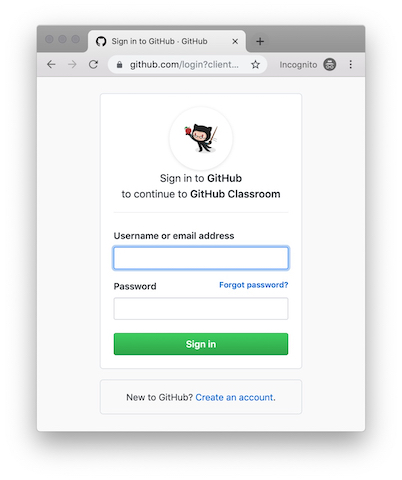
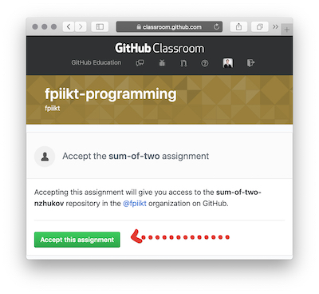

## Языки программирования

### Группы: P42551, P42552 

Используемая версия Python — *3.7.4*

[Ссылка](https://www.python.org/downloads) на дистрибутив для установки. Для работы в режиме [REPL](https://ru.wikipedia.org/wiki/REPL) используйте сервис [repl.it](https://repl.it)

[Лекция 1. Введение в Python](https://docs.google.com/presentation/d/1zWrdl6aaU0GrOmXKBeRhi5uXw31c9P-R_dpdloj3Tqo/edit?usp=sharing)

------

### Практическое задание 1.

1. Посмотрите [скринкаст](https://youtu.be/53f5vkI_gnM) о создании репозитория (личного сайта) и создайте собственный сайт-портфолио с использованием сервиса GitHub Pages.
2. Перейдите по [ссылке](https://classroom.github.com/a/3IfD0vwZ) и решите задачу, описанную там, в комментарии к решению укажите ссылку на сайт портфолио.

#### Дополнительная информация о Git и GitHub

- введение в использование GitHub [guides.github.com/activities/hello-world](https://guides.github.com/activities/hello-world/) (по ссылке также есть видеоинструкции);
- обучение использованию Git и GitHub [product.hubspot.com/blog/git-and-github-tutorial-for-beginners](https://product.hubspot.com/blog/git-and-github-tutorial-for-beginners);

Когда вы перейдёте по ссылке https://classroom.github.com/a/3IfD0vwZ, вам будет показано следующее как на изображении ниже (см. Рис. 1). 

_Рисунок 1_

Следует авторизоваться/зарегистрироваться в GitHub и открыть эту же ссылку снова. Как только вы это сделаете, вам будет предложено принять задание (кнопка «Accept this assignment») (см. Рис. 2). 

 
_Рисунок 2_

Когда это будет сделано, будет создан репозиторий, к которому вы и я будем иметь доступ. 
В этом репозитории вам необходимо разместить решение задачи, описание и требования к решению которой находятся там же в файле README.md.

